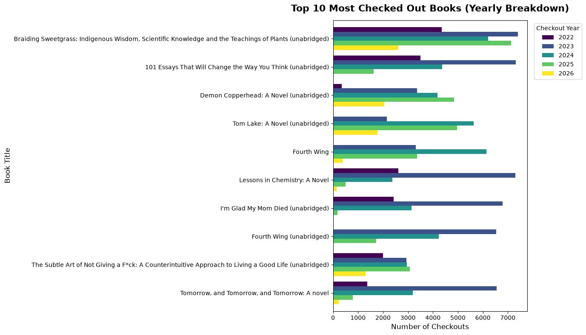
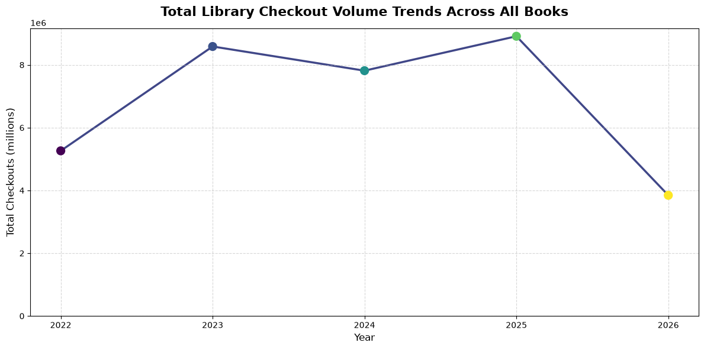
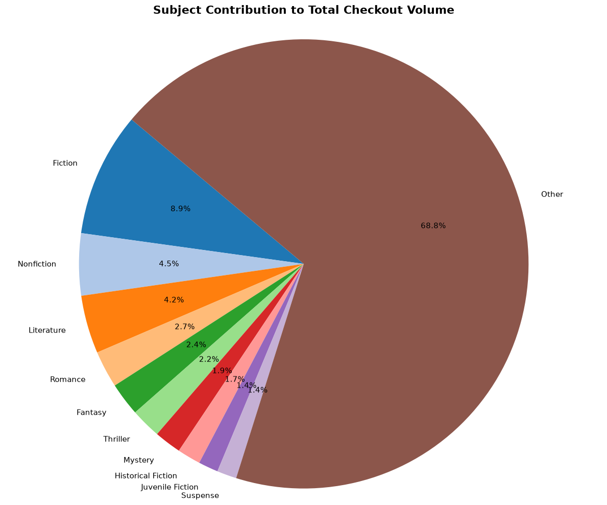

# Seattle Public Library Checkout Data Analysis Capstone

An automated data pipeline and visualization suite designed to analyze library book checkouts, track multi-year usage velocity, and break down patron preferences by subject matter.

## How to Install

This project uses [uv](https://github.com/astral-sh/uv), a fast Python package installer and resolver. Assuming you have `uv` installed, follow these steps:

1. **Open your terminal** and navigate to the project root directory. That contains the extracted CheckoutData.csv
2. **Install all dependencies** and automatically provision the virtual environment by running:
   ```bash
   uv sync

## How to Run

Ensure your raw data file is named `CheckoutData.csv` and resides in the same directory as the script. Execute the pipeline using:

```bash
python main.py
```
*(Alternatively, if you prefer running it without manual environment activation, you can use `uv run main.py` if dependency metadata is configured).*

---

## Results

The pipeline automatically processes unique records, handles multi-subject strings, aggregates statistics, and exports three high-quality visualizations:

### 1. Top 10 Most Checked Out Books (Yearly Breakdown)

*This horizontal bar chart illustrates the top ten most popular book titles based on their all-time total checkouts across the dataset. Each bar is color-coded by year using the Viridis colormap to reveal how individual book popularity shifted or sustained over time.*

### 2. Total Library Checkout Volume Trends Across All Books

*This line graph displays the macro-level trend of total annual checkouts for all books combined to illustrate library usage velocity over the years. The data points feature a Viridis gradient timeline overlay to clearly contrast older periods with more recent checkout volumes.*

### 3. Subject Contribution to Total Checkout Volume

*This pie chart displays the percentage contribution of different literary subjects toward the library's overall checkout volume. It highlights the top ten individual subjects uniquely while neatly grouping all remaining minor subjects into a collective "Other" slice for clean readability.*